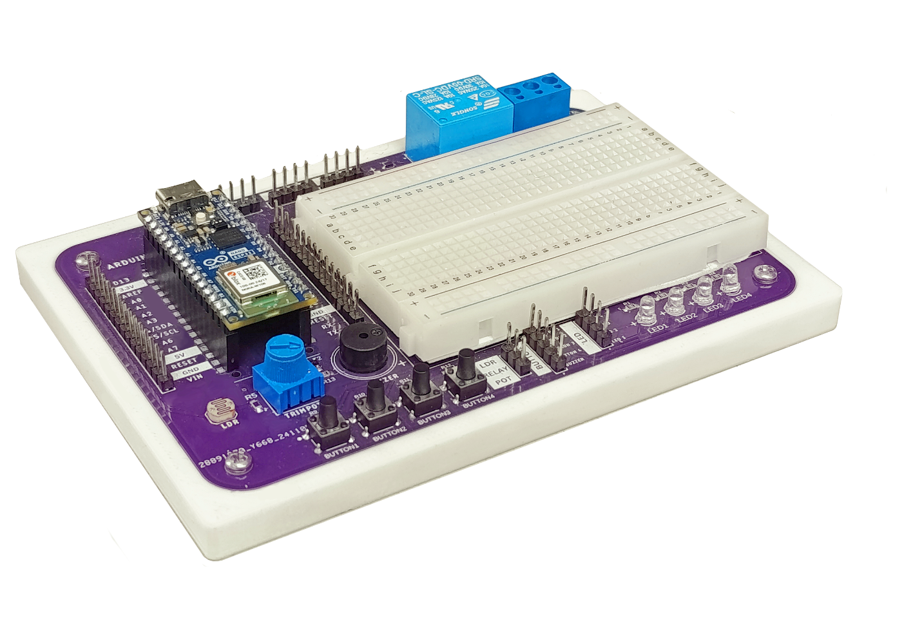
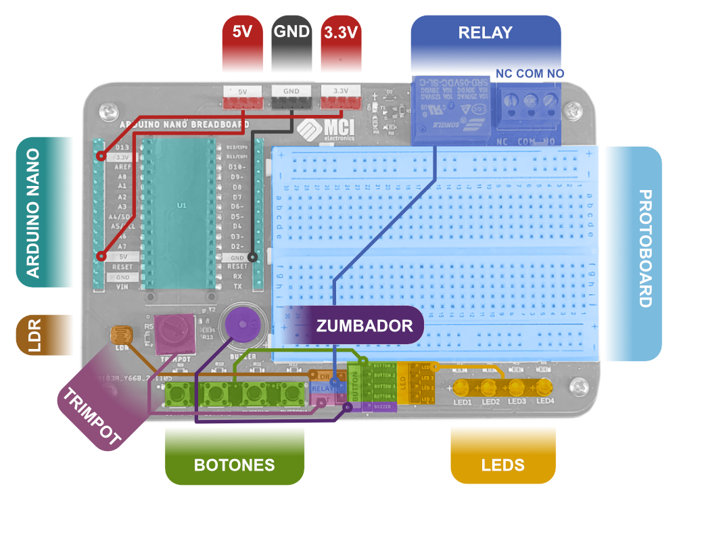
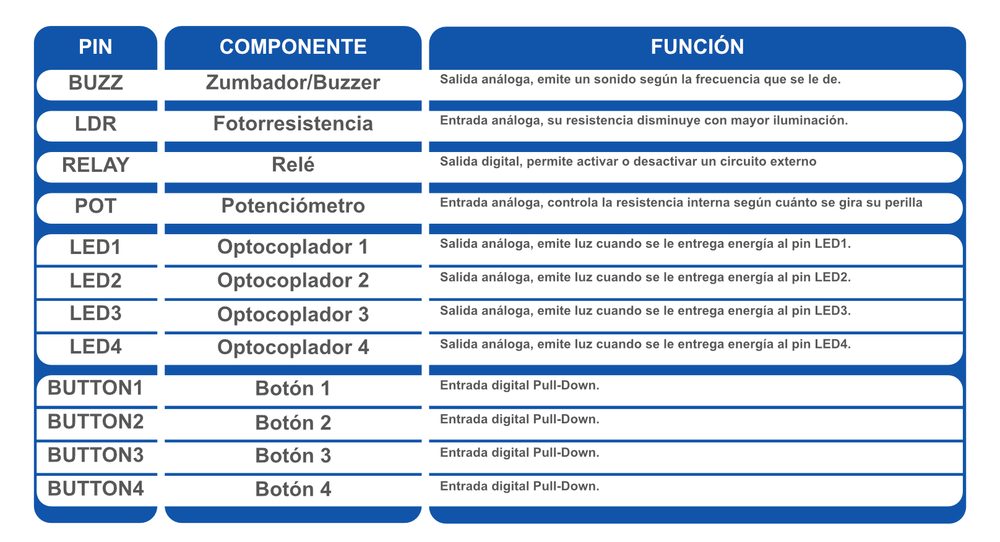
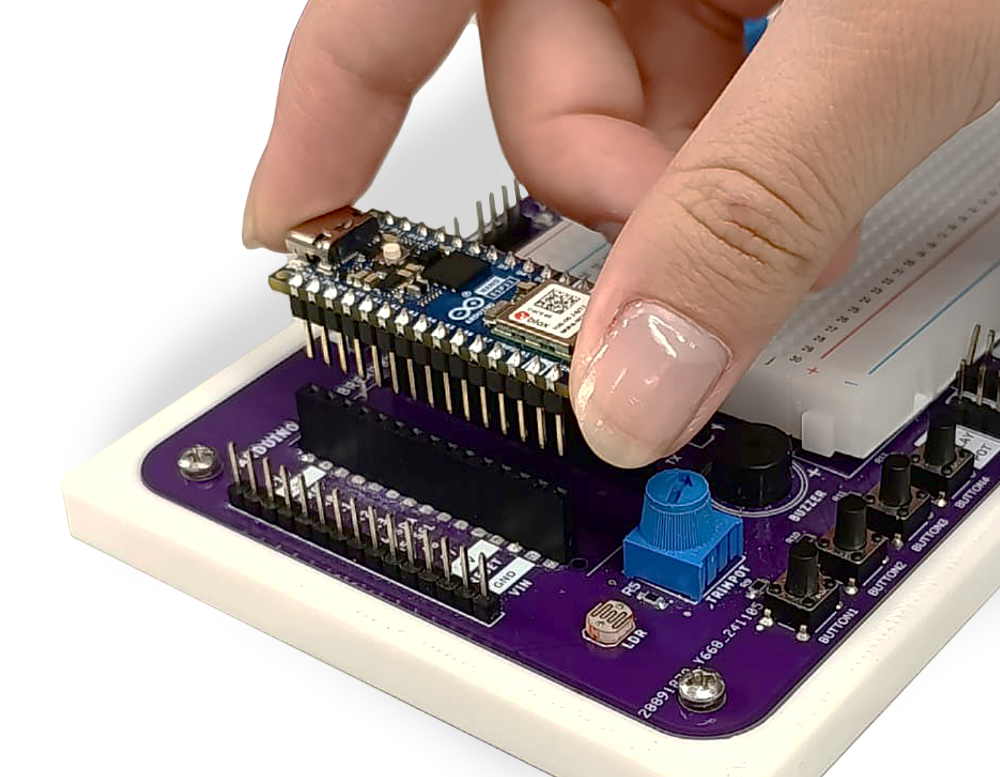
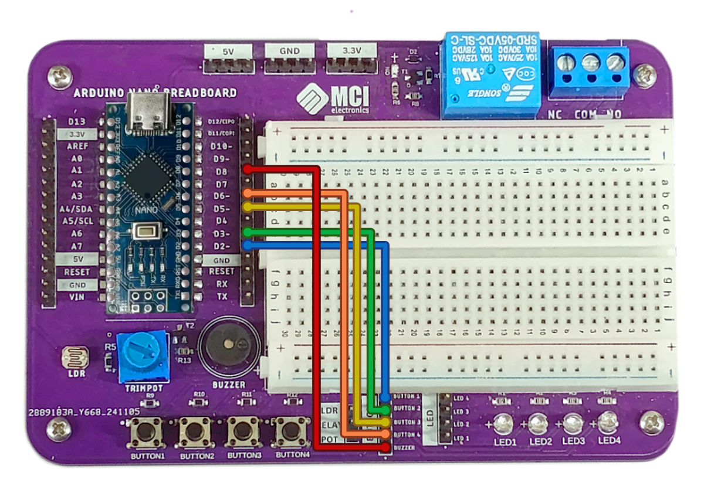
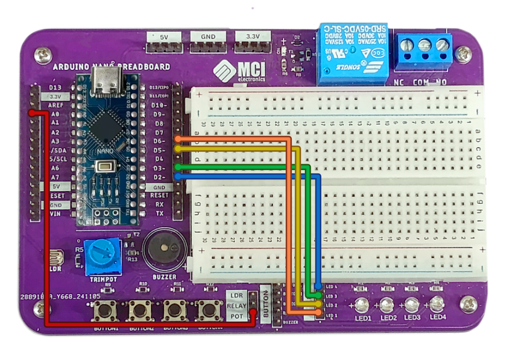
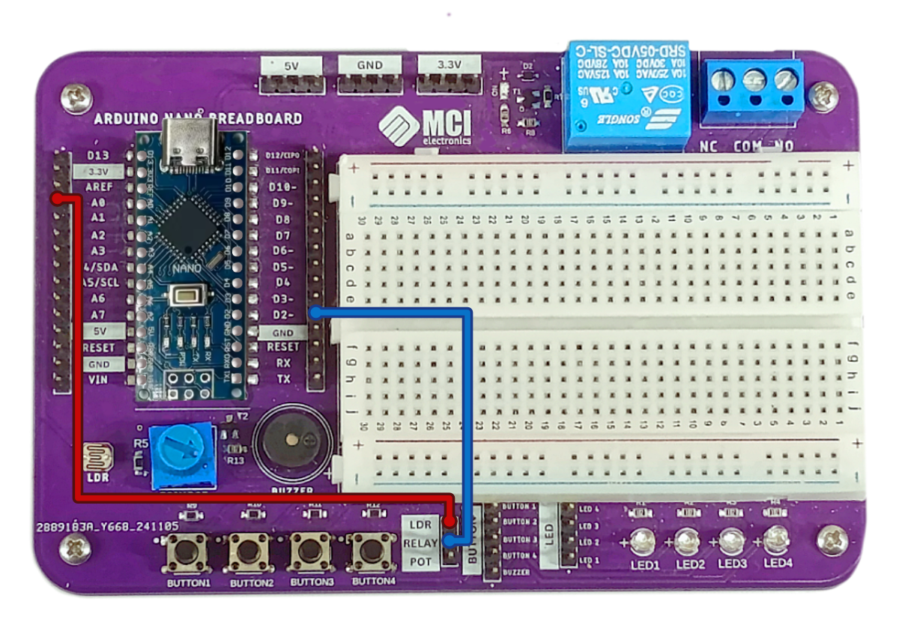

# MCI10794 - Nano Breadboard



**Nano Breadboard** es una tarjeta diseñada por **[MCI Electronics](https://mcielectronics.cl/)** que facilita el desarrollo de códigos. Gracias a su compatibilidad con Arduino Nano (y sus variedades como [Arduino Nano ESP32](https://mcielectronics.cl/shop/product/arduino-nano-esp32-con-headers/), [Arduino Nano Every](https://mcielectronics.cl/shop/product/arduino-nano-every-arduino-27853/), entre otros.) y sus componentes integrados conectados a tierra, Nano Breadboard es ideal para la educación y el prototipado rápido.

Dispone de 4 botones, 4 LEDs, 1 fotoresistencia, 1 potenciómetro, 1 zumbador y 1 relé con sus pines respectivos. Su variedad de componentes integrados permite la evaluación para inputs y outputs análogos y digitales utilizando solo un cable para controlar cada uno, manteniendo un trabajo ordenado y sencillo. En caso de que esto no sea suficiente, también incluye una protoboard de 400 puntos.

## Características principales

- 100% Compatible con Arduino Nano, [Arduino NANO 33 IoT](https://mcielectronics.cl/shop/product/arduino-nano-33-iot-arduino-27768/), [Arduino Nano ESP32](https://mcielectronics.cl/shop/product/arduino-nano-esp32-con-headers/), [Arduino Nano Every](https://mcielectronics.cl/shop/product/arduino-nano-every-arduino-27853/), [Arduino Nano R4](https://mcielectronics.cl/shop/product/arduino-nano-r4/) y [Placa Nano RF](https://mcielectronics.cl/shop/product/placa-nano-rf-para-arduino-nano-v3-0-tipo-c-con-nrf24l01-integrado/).
- No requiere soldadura
- Incluye protoboard de 400pts
- Pines GPIO expuestos con rieles de alimentación dedicados (5V, GND, 3.3V).
- Buzzer, Potenciómetro, LDR, Relay, 4 LEDs y 4 Botones integrados.
- Agujeros de montaje de 2.5M
- Dimensiones: 145 mm x 80 mm.

## Componentes y sus conexiones




## Empezando a usar Arduino Nano Breadboard

### Requerimientos de hardware

- Computador
- Arduino Nano u otro microcontrolador compatible.
- Cable USB compatible con nuestro microcontrolador
- Cable Hembra-hembra (No se necesitan más de 5 para los siguientes ejemplos)

### Requerimientos de software
- [Arduino IDE]()
- Librería de la tarjeta (En caso de no usar una de las predeterminadas en Arduino IDE.)

### Cómo conectar Arduino Nano a la tarjeta

Para poder utilizar la tarjeta Arduino Nano Breadboard primero es necesario conectarle un Arduino Nano. Para esto, es necesario asegurarse de que la tarjeta Arduino Nano tiene headers macho soldados. Con esto listo, debería calzar dentro de los headers hembra de la tarjeta, como se ve a continuación:



## Ejemplo 1: Botones y Buzzer

El primer ejemplo utiliza los cuatro botones integrados como un piano junto al buzzer: Cada botón reproduce una nota distinta.

### Conexiones



### Código

```cpp
int botones[4]= {2, 3, 5, 6};
int buzzer= 8;

void setup() {
  Serial.begin(9600);
  pinMode(buzzer, OUTPUT);
  for (int i = 0; i <= 3; ++i){
    pinMode(botones[i], INPUT_PULLUP);
  }
}

void loop() {
  bool bot1= digitalRead(2);
  bool bot2= digitalRead(3);
  bool bot3= digitalRead(5);
  bool bot4= digitalRead(6);

  if (bot1 == 1){
    tone(8, 190, 100);
    Serial.println("Bot1");
    while (bot1 == 1) {
      bot1= digitalRead(2);
    }
  } else if (bot2 == 1){
    tone(8, 294, 100);
    Serial.println("Bot2");
    while (bot2 == 1) {
      bot2= digitalRead(3);
    }
  } else if (bot3 == 1){
    tone(8, 392, 100);
    Serial.println("Bot3");
    while (bot3 == 1) {
      bot3= digitalRead(5);
    }
  } else if (bot4 == 1){
    tone(8, 440, 100);
    Serial.println("Bot4");
    while (bot4 == 1) {
      bot4= digitalRead(6);
    }
  } else {
    noTone(8);
  }
  delay(10);
}
```

## Ejemplo 2: Potenciómetro y leds

Este ejemplo cambia la intensidad del brillo de los LEDs con el potenciómetro. Al mismo tiempo se puede leer el valor del potenciómetro en el monitor serial. Mientras este valor sea mayor, más brillan los LEDs.

### Conexiones



### Código

```cpp
int pins[4]= {2, 3, 5, 6};
void setup() {
  Serial.begin(9600);
  for (int i=0; i <= 3; ++i){
    pinMode(pins[i],OUTPUT);
  }
}

void loop() {
  int pot= analogRead(A0);
  Serial.print("Lectura del potenciómetro: ");
  Serial.println(pot);
  int luz= map(pot, 0, 4095, 0, 255);
  Serial.print("Intensidad de los led: ");
  Serial.println(luz);
  for  (int i = 0; i <= 3; ++i) {
    analogWrite(pins[i], luz);
  }
  delay(200);
}
```

## Ejemplo 3: LDR y Relay

Este último ejemplo enciende el relé cuando el valor que entrega la fotorresistencia es menor que el de un umbral que definimos. Se debe escuchar un clickeo cuando se enciende o apaga el relé.

### Conexiones



### Código

```cpp
int RELAY= 2;
int tolerancia= 3500;

void setup() {
  pinMode(2, OUTPUT);
  Serial.begin(9600);
}

void loop() {
  int LDR= analogRead(A0);
  Serial.print("Lectura LDR: ");
  Serial.print(LDR);
  if (LDR < tolerancia) {
    digitalWrite(RELAY, HIGH);
    Serial.println(" - RELAY ENCENDIDO");
  } else {
    digitalWrite(RELAY, LOW);
    Serial.println(" - RELAY APAGADO");
  }
  delay(100);
}
```
